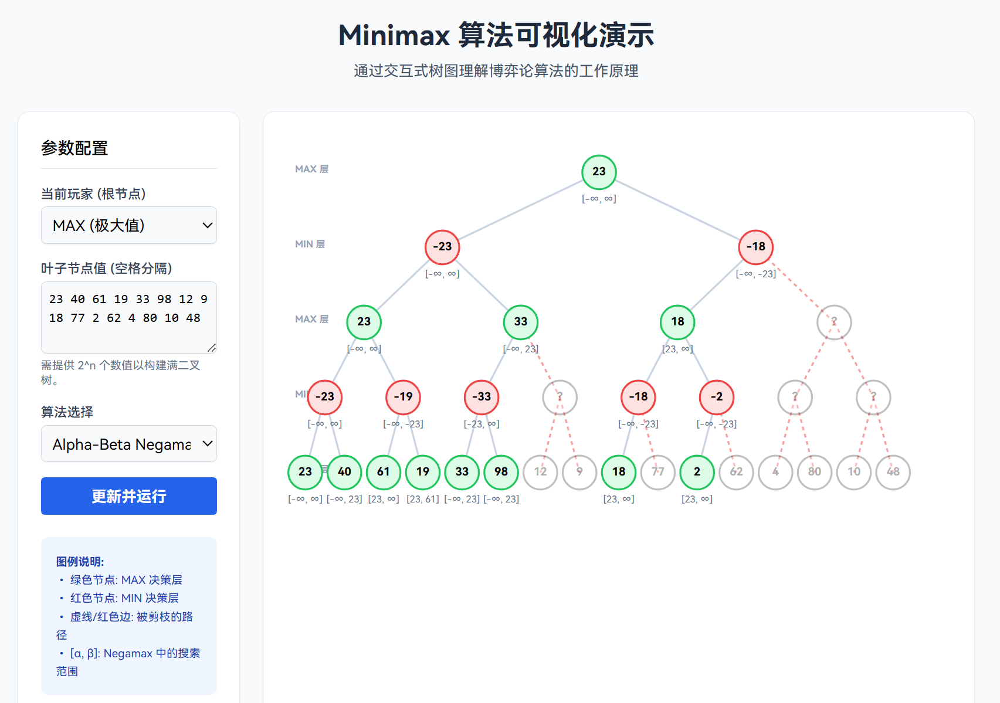

# Mojiapps

A collection of simple web applications, mostly built with Gemini. Have fun!

## Minimax Visualizer

Link: [/minimax.html](/minimax.html)

A Minimax / Alpha-Beta pruning visualizer.

## Arrow Puzzle

Link: [/arrow-puzzle.html](/arrow-puzzle.html)

An arrow puzzle game inspired by the minigame in "Exponential Idle".

## Balatro Hold'em

Link: [/balatro.jsx](/balatro.jsx) (React)

A simple implementation of Balatro core mechanics based on Texas Hold'em poker.

## Klondike Solitaire

Link: [/klondike.html](/klondike.html)

A simple Klondike Solitaire game.

